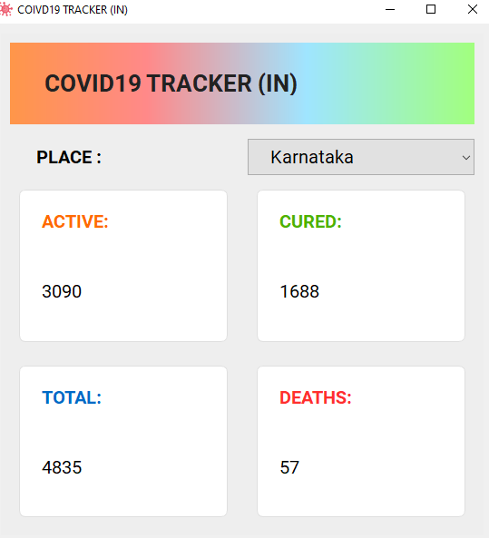

# COVID19 TRACKER IN

This is a python3 application that displays active, cured, dead, total coronavirus cases in the selected state of India. It defaults to state Karnataka when you run it and you can change it to any other state by using the drop down box.

